# 仓库管理系统

### 有问题，或者不会调试运行的同学, 可以添加微信：xzxj0206

## 一、介绍

基于springboot+jsp的仓库管理系统

主要技术： springboot , java , jsp , mysql , spring , springmvc , mybatis 

系统一共2种用户登录，分别为超级管理员和 仓库管理员两个角色

基础管理：客户管理，供应商管理，商品管理仓库管理：入库，出库，仓库基础设置

系统设置：角色管理，用户管理

## 二、系统运行界面

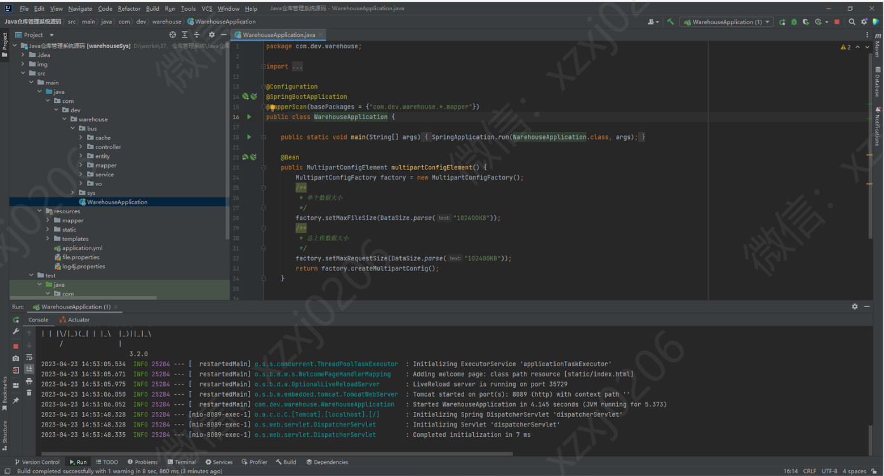

## 三、系统功能运行截图

### 1、系统管理员

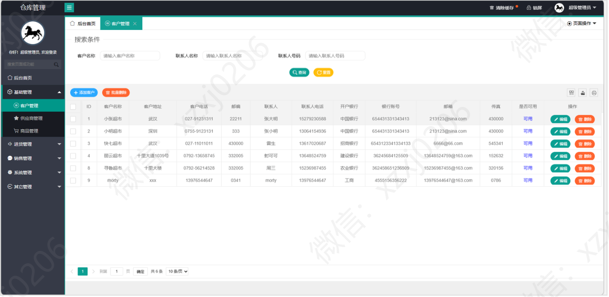

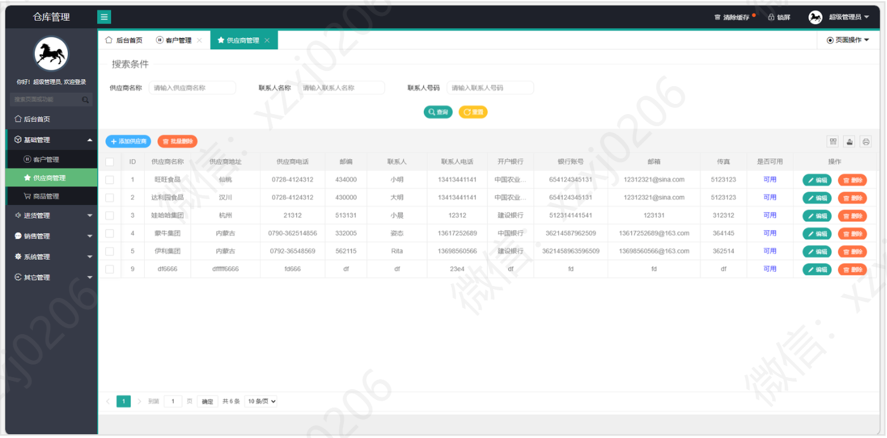

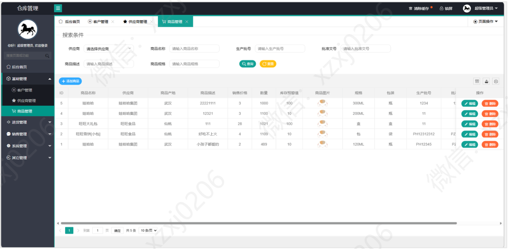

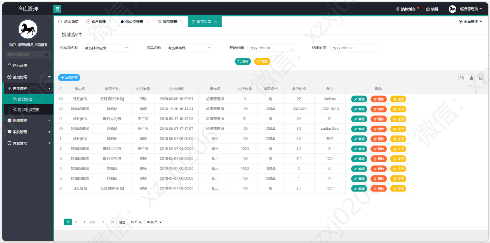

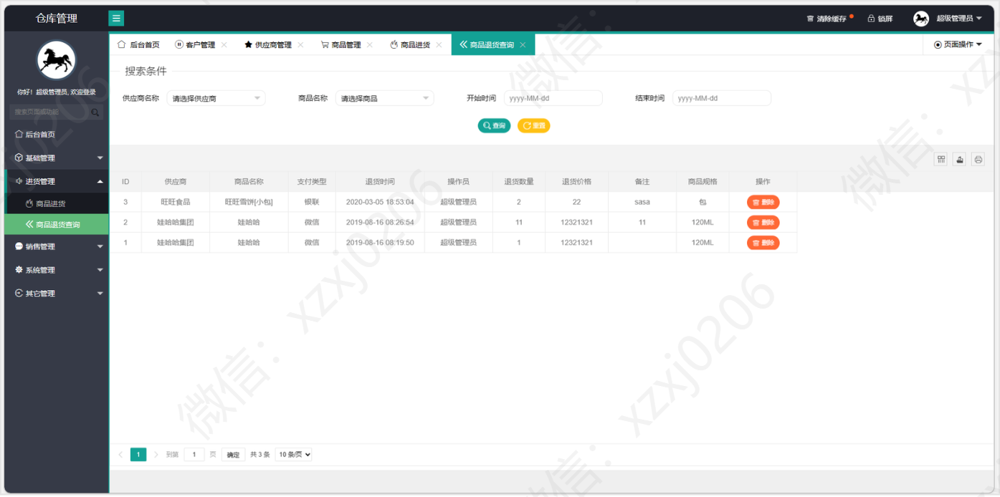

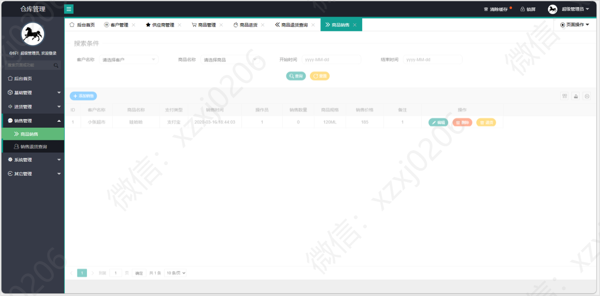

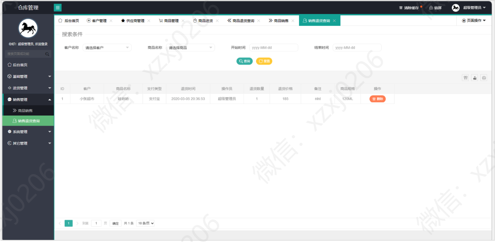

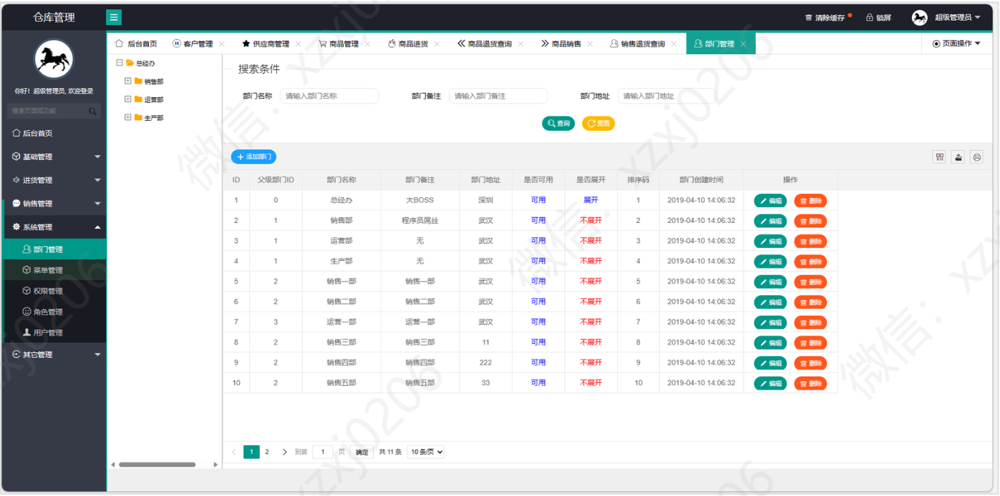

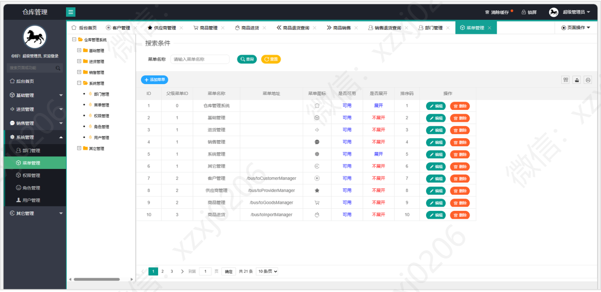

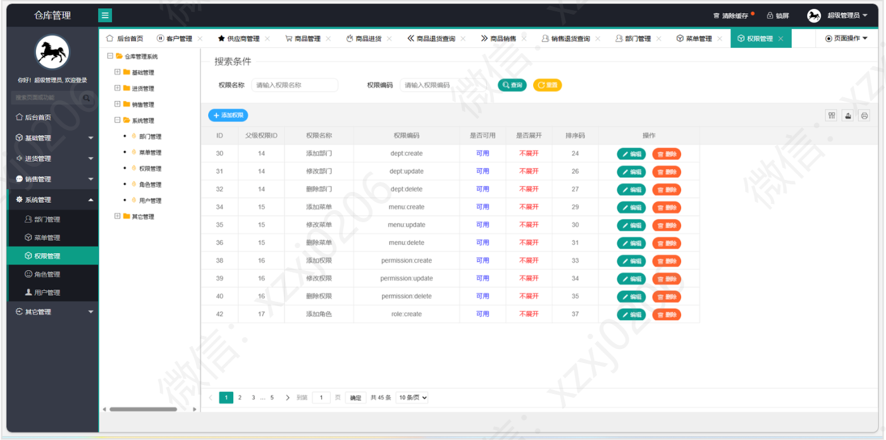

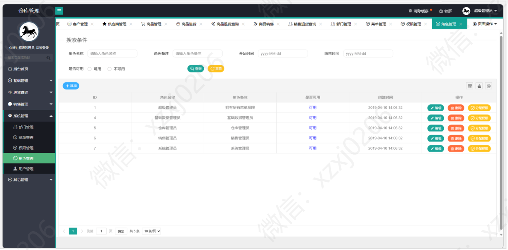

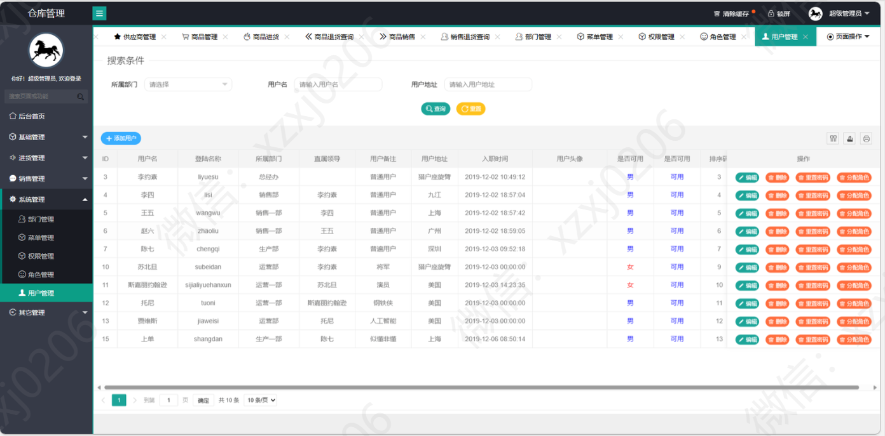

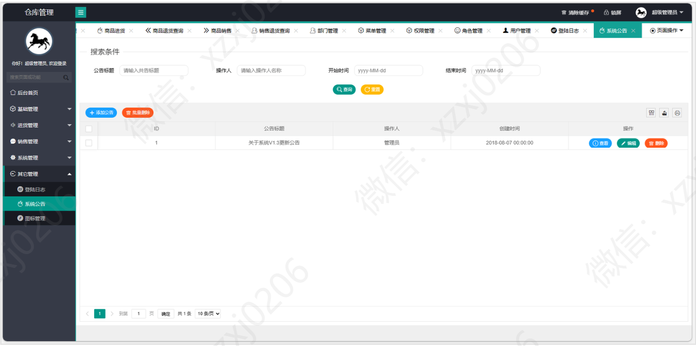

### 2、用户

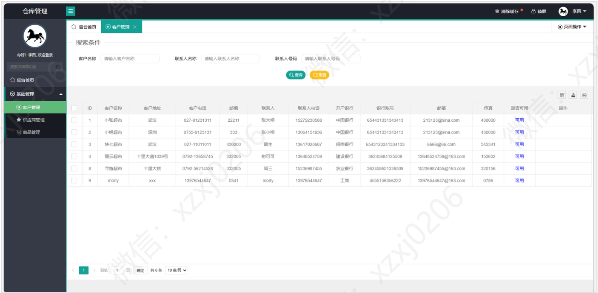

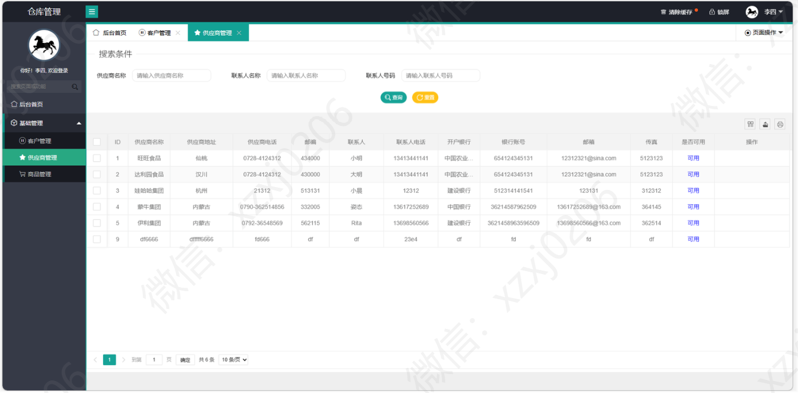

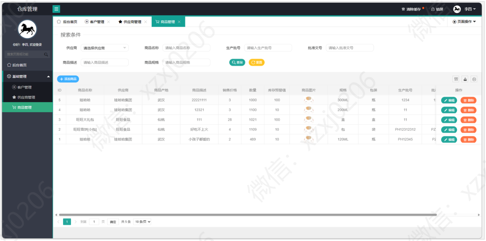

